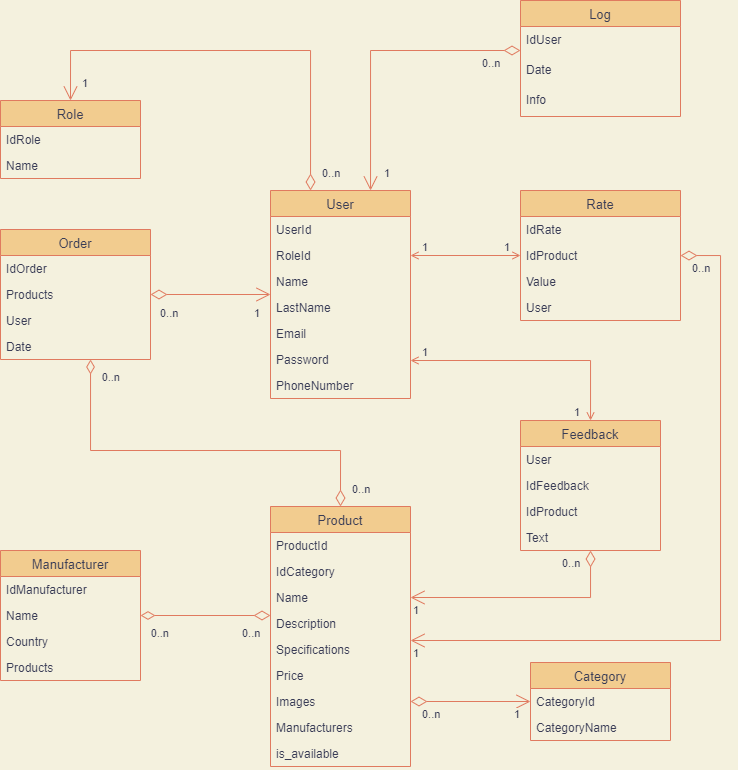

### E-Commerce Project

### Функциональные требования

**а)Авторизация пользователей**  
В авторизацию пользователей будет входить введение логина и пароля, после чего будет переход на страницу в зависимости от роли пользователя  

**б)Управление пользователями**  
Управление пользователями будет осуществляться через админ панель

**с)Система ролей**  
Система ролей будет состоять из:  
* Клиента  
    * Аутентификация
    * Взаимодействие с корзиной (добавление и удаление продукта)
    * Возможность оставить отзыв о продукте
    * Возможность оценить продукт
    * Сможет покупать товары, взаимодействовать с корзиной, оформлять заказ, заполнять платежные данные, просматривать информацию о заказе  
* Администратора  
    * Редактирование корзины (удаление, добавление, изменение кол-ва продуктов)
    * Удаление отзывов и оценок
    * Редактирование информации о пользователе
    * Проверка логов 
 

## Сущности
  
* **User** - все пользователи 
    * **UserId(uuid)** - идентификатор пользователя, Many to One к Роли
    * **RoleId(uuid)** - идентификатор роли
    * **Name(varchar(20))** - имя пользователя
    * **LastName(varchar(20))** - фамилия пользователя
    * **PhoneNumber(varchar(20))** - номер пользователя
    * **UserEmail(varchar(50))** - эл. почта пользователя
    * **UserPassword(varchar(250))** - пароль

* **Role** - роли пользователей
    * **IdRole(uuid)** - идентификатор
    * **Name(varchar(20)) - название роли

* **Category** - категория 
    *  **CategoryId(uuid)** - ид. номер категории - One to Many к Продукту  
    *  **CategoryName(varchar(30))** - название категории   

* **Product** - продукт
    * **ProductId(uuid)** - идентификатор продукта, Many to One к Категории, Many to Many к Производству, One to Many к Отзывам, Оценке
    * **IdCategory(uuid)** - идентификатор категории
    * **Name(varchar(50))** - название продукта
    * **Price(float >0)** - цена
    * **Specification(varchar(500))** - спецификации продукта
    * **Description(varchar(500))** - описание продукта
    * **Images(varchar(100))** - путь к изображениям продукта
    * **Availibility (bool)** - доступность продукта

* **Order** - заказ
    * **OrderId(uuid)** - идентификатор заказа
    * **User(uuid)** - идентификатор пользователя
    * **Date(datetime)** - дата и время оформления заказа

* **Manufacturer** - изготовитель
    * **IdManufacturer(uuid)** - идентификатор производства
    * **Name(varchar(50))** - название производства
    * **Country(varchar(50))** - страна производитель

* **ManufacturerProduct** - many-to-many table между Manufacturer и Product
    * **IdManufacturer(uuid)** - идентификатор
    * **IdProduct(uuid)** - идентификатор

* **ProductOrder** - many-to-many table between Order and Product
    * **IdOrder(uuid)** - идентификатор
    * **IdProduct(uuid)** - идентификатор

* **Log** - журнал активности пользователя
    * **IdUser(uuid)** - uuid(foreign key)
    * **Date(datetime)** - дата и время действий пользователя
    * **Info(varchar(100))** - действие пользователя

* **Feedback** - отзывы о продукте
    * **User(uuid(IdUser))** - One to One к feedback user
    * **IdFeedback(uuid)** - идентификатор
    * **IdProduct(uuid)** - идентификатор
    * **Text(varchar(200))** - текст отзыва

* **Rate** - оценка продукта
    * **IdRate(uuid)** - идентификатор
    * **IdProduct(uuid)** - идентификатор
    * **Value(int)** - оценка продукта от 1 до 5
    * **User(uuid)** - IdUser, one to one rate user
